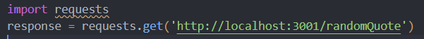
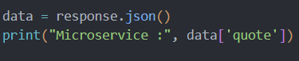
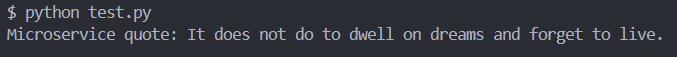
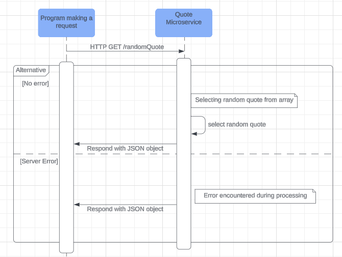

# Quote Microservice

## Instructions
1. Clone repository and navigate to project folder
2. Install dependencies by running "npm install"
3. Run server by running "node quoteMicroservice.js" 

## Communication Contract

### 1. Requesting Data
To request data from the microservice, make an HTTP GET request to the following endpoint (port number can be changed depending on what is free on your machine):

**Endpoint**:  
`http://localhost:3001/randomQuote`

Example call in Python:

### 2. Receiving Data
The microservice responds with a quote in JSON format({"quote": "..."})

Example call in Python:

Response:

### 3. UML sequence diagram

